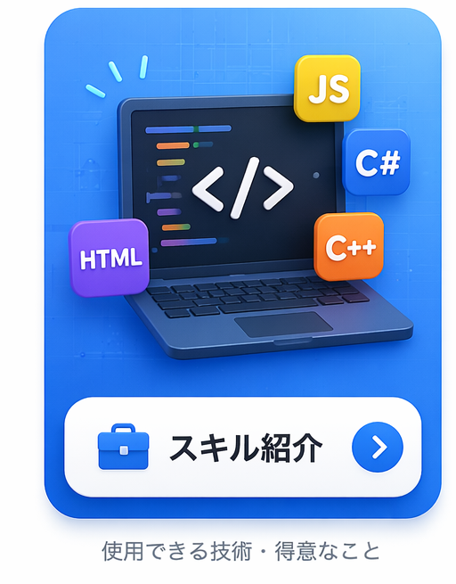
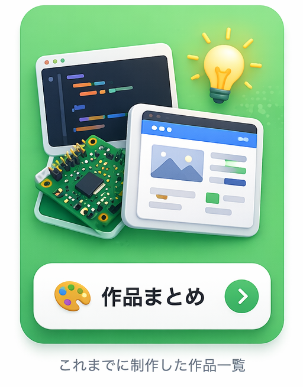
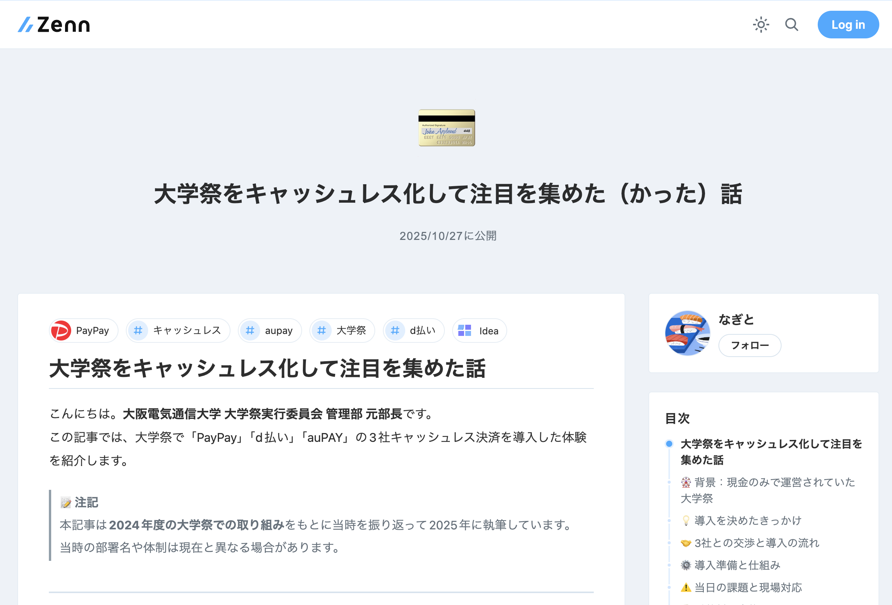

# 👋 Hi there, I'm **nagito**

<!--MD.mdへのリンク-->
[MD記法メモ](./MD.md)

---
> [!TIP]
> **電子工作 × Web × 自動化**
>
> GAS / HTML / JavaScript / C# / C++ / Raspberry Pi
> 制作・設計・システム連携など幅広く活動しています。

---

## 📑 Contents

👇 カードをクリックして各セクションへジャンプ

 
  
  &nbsp;&nbsp;
  
  &nbsp;&nbsp;
  

---

  
  
  

---

## 🧰 My Skills

### 💻 Languages

  
  
  
  
  
  
  
  

### 🔌 Hardware

  
  

### ☁️ Cloud & API

  
  
  
  
  

### 🛠️ Tools

  
  
  
  
  
  

---

## 🎨 Works — 制作一覧

> 過去の制作物の一覧は別ページにまとめています。

  

---

## 🌐 Other Links — 公開中のサイト

| サムネイル | サイト | 種類 |
| :---: | :---: | :---: |
|  | [燃えないゴミ(作品一覧)](https://moenaigomi.com/) |  |
|  | [大学祭をキャッシュレス化して注目を集めた（かった）話](https://zenn.dev/nagito/articles/cf86fe31d73018) | [Zenn](https://zenn.dev/nagito/articles/cf86fe31d73018) |

---

  🧭 Designed & maintained by <b>nagito</b> — <a href="https://github.com/nagito-hiroshima">GitHub Profile</a>

