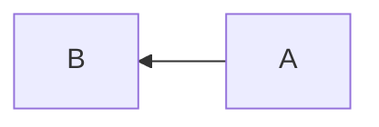
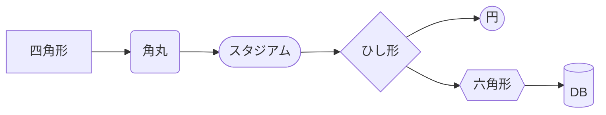
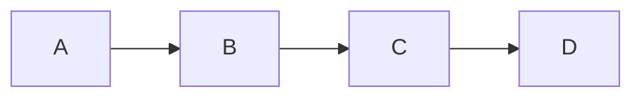
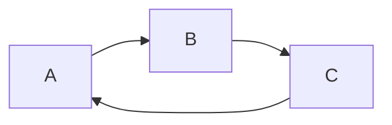
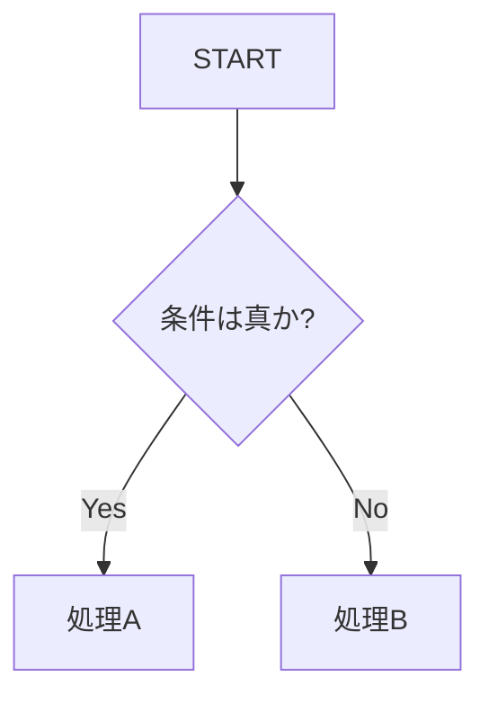
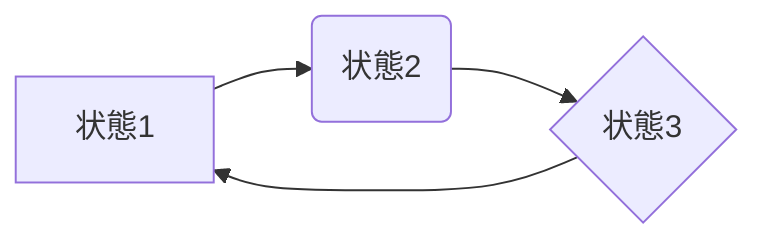
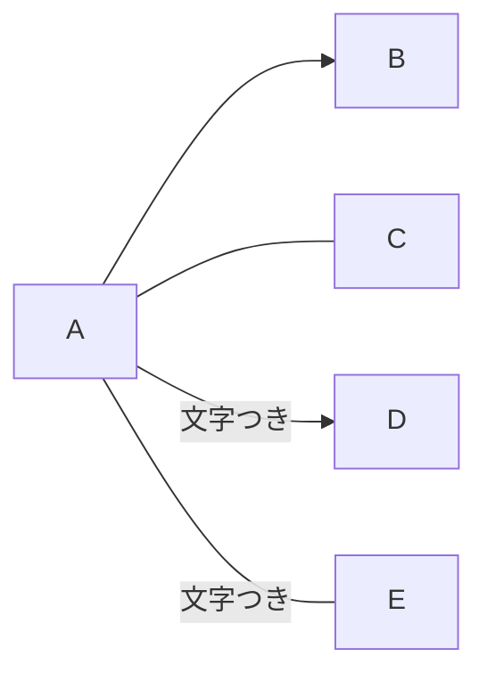
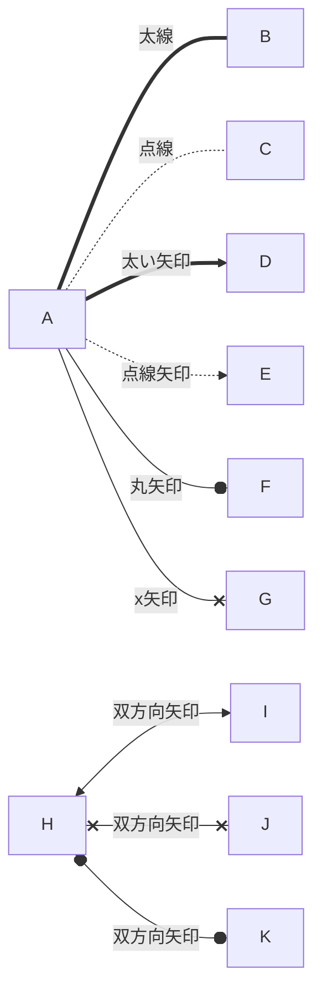
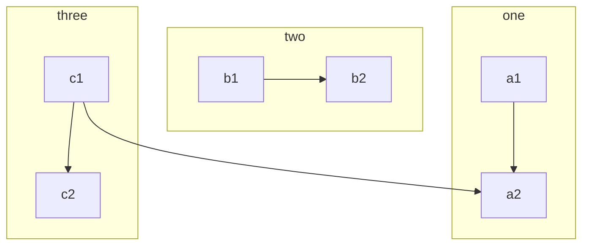

[← ホーム に戻る](README.md)

> [!NOTE]
> ノートやヒントなど、ユーザーにとって有益な情報を提供するためのセクションです。

> [!TIP]
> ユーザーが特定のタスクを効率的に完了するためのヒントやコツを提供します。

> [!IMPORTANT]
> ユーザーが成功するために必要な重要な情報です。

> [!WARNING]
> 潜在的なリスク due to potential risks.

> [!CAUTION]
> 行動の否定的潜在結果です。


# Mermaid記法メモ
## 記法の種類
### グラフ
#### 右向きのフローチャート
```
flowchart LR
```


#### 上下向きのフローチャート
```
flowchart TB
```


#### 左右向きのフローチャート
```
flowchart RL
```


| 記法 | コード例 | 説明 |
| --- | --- | --- |
| TB　| `flowchart TB` | ↓ |
| TD　| `flowchart TD` | ↓ |
| BT　| `flowchart BT` | ↑ |
| LR　| `flowchart LR` | → |
| RL　| `flowchart RL` | ← |

### ノード
ノードは図の中の「箱」にあたる要素で、囲み記号によって形状が変わります。

| 記法 | 形状 | コード例 |
| --- | --- | --- |
| `A[text]` | 四角形 | `A[四角形ノード]` |
| `A(text)` | 角丸四角形 | `A(角丸ノード)` |
| `A([text])` | スタジアム形 | `A([スタジアム])` |
| `A[[text]]` | サブルーチン | `A[[サブルーチン]]` |
| `A[(text)]` | 円柱（DB） | `A[(データベース)]` |
| `A((text))` | 円 | `A((円ノード))` |
| `A{text}` | ひし形（条件分岐） | `A{条件}` |
| `A{{text}}` | 六角形 | `A{{六角形}}` |
| `A[/text/]` | 平行四辺形 | `A[/入力/]` |
| `A[\text\]` | 逆平行四辺形 | `A[\出力\]` |



## 図の基本構造
#### 1. 基本的なフローチャート

#### 2. ループ（循環）


#### 3. 条件分岐（ひし形ノード）


#### 4. ノード形状の組み合わせ


#### 5. エッジ（線・矢印）にテキストを付ける
- `A -->|文字つき| B` または `A -- 文字つき --> B` でラベルを付与できる


#### 6. 矢印のスタイル


#### 7. サブグラフの使用例
